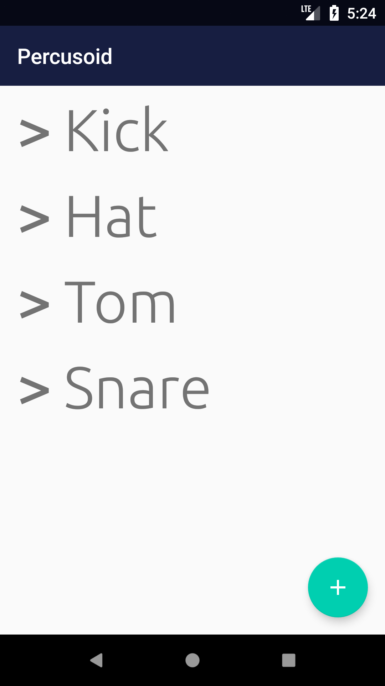
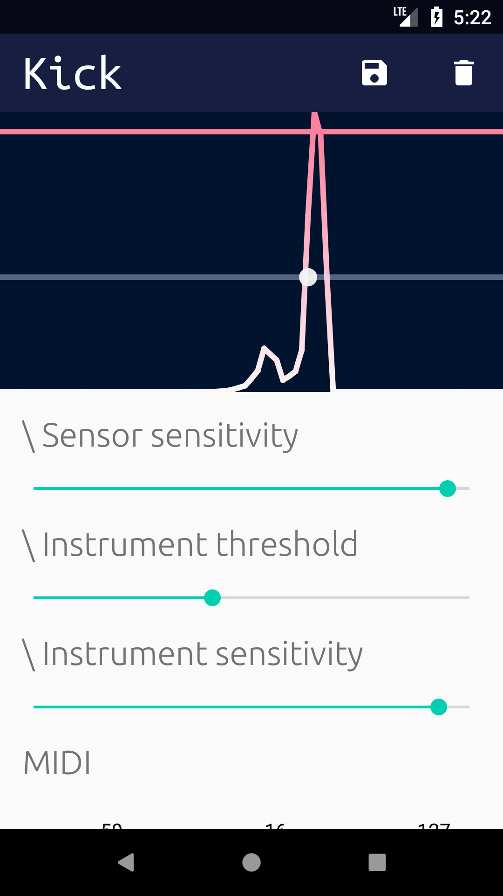
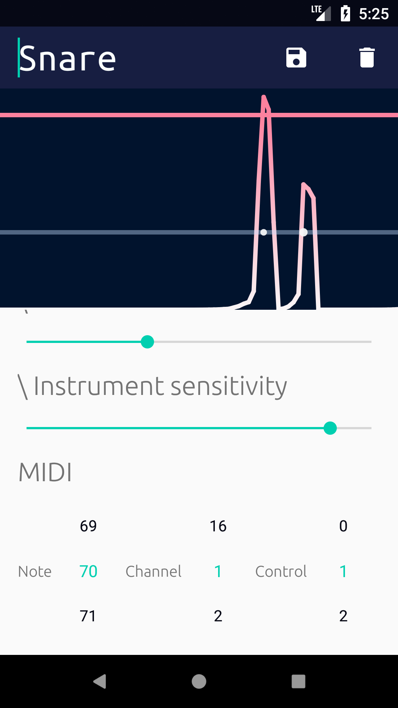

# Percusoid
Android experiment that uses a device as percussion MIDI controller

**It's work in progress on really early stage - hacks and bugs everywhere.**

_Please, feel free to open issues or write me_

The inspiration is taken from [this](https://youtu.be/G_hBhORGE6Y) project. 
But as you can imagine this app is far cry from what do they have in [Mogees](https://www.mogees.co.uk)
  
It works only in conjunction with [Loop Midi](https://www.tobias-erichsen.de/software/loopmidi.html) and
[PercusoidDesktopServer](https://github.com/Apisov/PercusoidDesktopServer)

## How to run
- Build or install the application
- Install [Loop Midi](https://www.tobias-erichsen.de/software/loopmidi.html), 
create there a midi port with exact name `Virtual MIDI Bus`
- Run a prebuilt Windows `PercusoidServer` app or build it from [sources](https://github.com/Apisov/PercusoidDesktopServer)
- Create an instrument inside of the app. Adjust instrument's configs according to your needs.

## Instruction for the app
1. First screen is a list of instruments(if there any).
Nothing special, use `+` button to create new instrument. 

1. Instrument creation and Instrument details share the same screen. 
You can see 3 controls to tweak:
- Sensor sensitivity _**1**_
- Instrument threshold _**2**_
- Instrument sensitivity _**3**_

_**1**_ is responsible for a scale coefficient of accelerometer data. Bigger value of it means less sensitive sensor.

_**2**_ tells the app when to trigger a `hit` for MIDI. Whenever accelerometer graph line crosses that line it triggers a `hit`

 _**3**_ represents how easy you can get max value for MIDI output. 
 If try to say more clear - the more low corresponding line then the louder sound is

 

1. In the end of instrument config we gave MIDI options
 - Note pitch
 - Channel
 - Control
 
We need this because Percusoid app sends not only hits midi signal but also continuous control changes that possible to use as 
automation for an instrument in DAW for example. To make these controls different from each other in perspective of MIDI you can assign different channels and controls.

