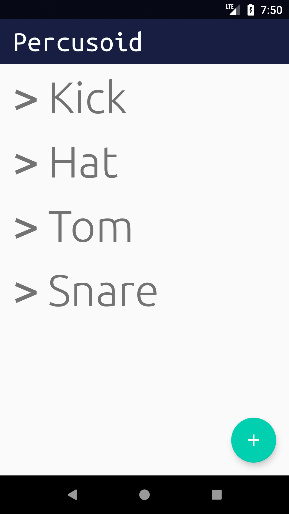

# Percusoid
An android experiment that uses a device as percussion MIDI controller

**It's work in progress on really early stage - hacks and bugs everywhere.**

_Please, feel free to open issues or write me_

The inspiration is taken from [this](https://youtu.be/G_hBhORGE6Y) project. 
But as you can imagine this app is far cry from what do they have in [Mogees](https://www.mogees.co.uk)
  
It works only in conjunction with [Loop Midi](https://www.tobias-erichsen.de/software/loopmidi.html) and
[PercusoidDesktopServer](https://github.com/Apisov/PercusoidDesktopServer)

## How to run
- Build or install the application
- Install [Loop Midi](https://www.tobias-erichsen.de/software/loopmidi.html), 
create there a midi port with an exact name `Virtual MIDI Bus`
- Run a prebuilt Windows `PercusoidServer` app or build it from [sources](https://github.com/Apisov/PercusoidDesktopServer)
- Create an instrument inside of the app. Adjust instrument's configs according to your needs.

  
## Instruction for the app
1. First screen is a list of instruments. Nothing special, use `+` button to create a new instrument.

2. Instrument creation and Instrument details share the same screen. There are 3 controls to tweak:
- Sensor sensitivity — _scale coefficient of accelerometer data. Bigger value = less sensitive sensor = punch firmly._
- Instrument threshold — _whenever accelerometer graph line crosses this threshold it triggers a `hit` for MIDI_
- Instrument sensitivity — _affects MIDI velocity parameter. The lower value then the easier you need to punch to get loud sound_

3. At the end of instrument config, we have MIDI options:
 - Note pitch
 - Channel
 - Control
 
We need this because Percusoid app sends not only "hits" midi signal but also continuous control changes that possible to use as automation for an instrument in DAW for example. 

To make these controls different from each other in perspective of MIDI you can assign different channels and controls.
